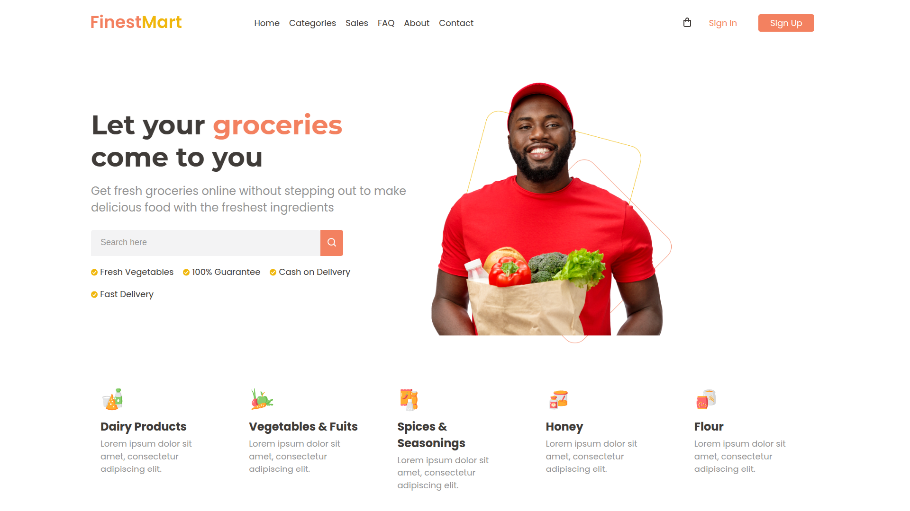
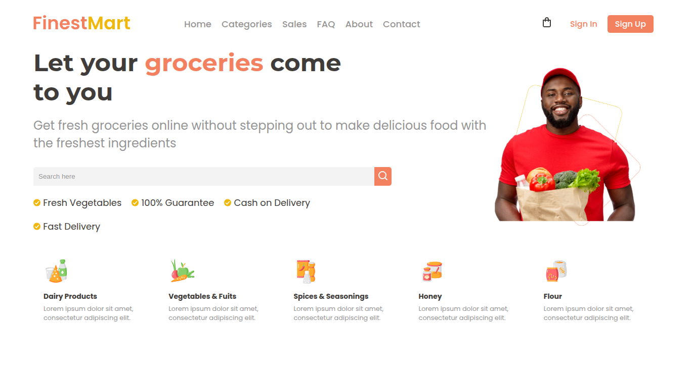
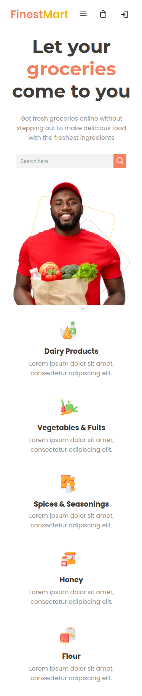
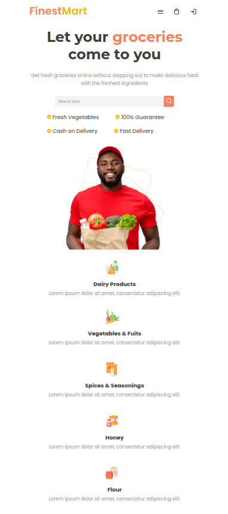

# Grocery Store Header

## Capturas de pantalla

**Desktop**



**Laptop**



**Mobile**



**Tablet**




## Descripción

Este proyecto consiste en la creación de un encabezado (`header`) para un comercio. El objetivo es proporcionar una interfaz atractiva y funcional que mejore la experiencia del usuario al navegar por el sitio. Es el primer proyecto que realizo tratando de hacerlo responsive para dispositivos moviles y pantallas pequeñas.

---

## Índice

1. [Tecnologías Utilizadas](#tecnologías-utilizadas)
2. [Instalación](#instalación)
3. [Uso](#uso)
5. [Objetivo](#cobjetivo)
6. [Contacto](#contacto)

---

## Tecnologías Utilizadas

- **HTML5**: Estructura del contenido web.
- **SCSS**: Preprocesador CSS para estilos más eficientes y organizados.

---
## Instalación

Para ejecutar este proyecto en tu entorno local, sigue estos pasos:

1. **Clona este repositorio:**
   ```sh
   git clone https://github.com/jrramoncp/grocery_store_header
   cd grocery_store_header
   ```

2. **Instala las dependencias:**
Asegurate de tener Node.js instalado. Luego ejecuta:
   ```sh
   npm install
   ```

3. **Inicia el entorno de desarrollo con Vite:**
   ```sh
   npm run dev
   ```

4. **Abre el navegador en la dirección indicada en la terminal (por defecto, suele ser `http://localhost:5173/`).**

---

## Uso

Una vez iniciado el servidor de desarrollo, podrás visualizar el encabezado del sitio web. Puedes personalizar los estilos y el contenido según las necesidades específicas de tu proyecto.

---

## Objetivo del Proyecto

El objetivo de este proyecto es mejorar mis conocimientos en CSS, SCSS, diseño web y responsive. No cuenta con funcionalidades interactivas, ya que está enfocado en el aspecto visual y la estructura. 

--- 

## Contacto

GitHub: [jrramoncp](https://github.com/jrramoncp).

Email: joseramoncaravaca@gmail.com.

Instagram: [jrramoncp](https://www.instagram.com/jrramoncp).


---

📌 **Nota:** Este proyecto es parte de mi aprendizaje y no representa un producto finalizado.